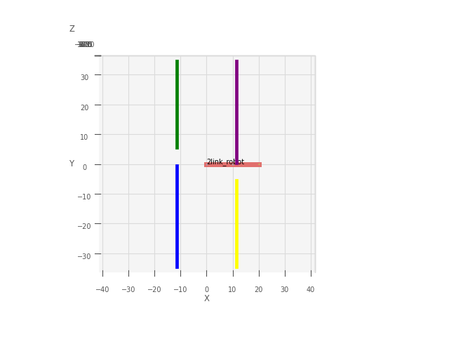

#  Sampling based Trajectory and Motion Planning for Control of 2 DOF Robotic Manipulator
Executed a sampling based motion and trajectory planning algorithm based on the RRT* algorithm using Inverse and Forward kinematics on a 2 DOF robotic manipulator to successfully trace multiple waypoints while avoiding body collision with surrounding obstacles

How to run the code:
1. The RRT_star planner file contains all the functions and the main RRT* planner to run the algorithm.
2. The two_link.urdf file contains the 2 link robot where robot parameters can be set.

The environment for the robot and the obstacles in a 2D environment have been shown in the figure below.

The code first creates a configuration space from the given environment and the RRT* planner is run in the configuration space.

## *RRT_star planner for tracking multiple waypoints *
The robot tracks 7 waypoints. Each cycle of tracking is represented by red dot as starting point and green dot as final goal.

The following gif shows simultaneous planning of robot in the Cartesian space and the configuration space.

The number of iterations for RRT* algorithm to run is set to 2000. Increasing the number of iterations will increase computation time but will give a more optimized planned trajectory.

